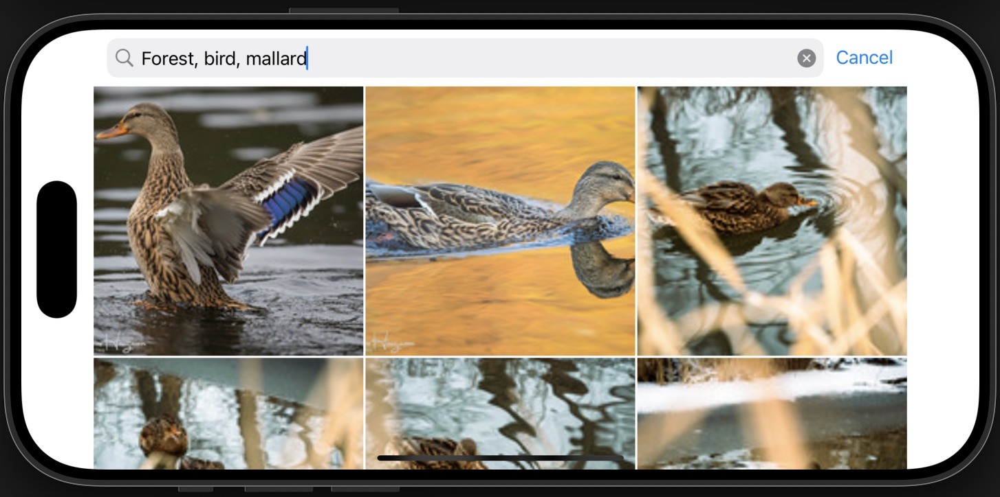
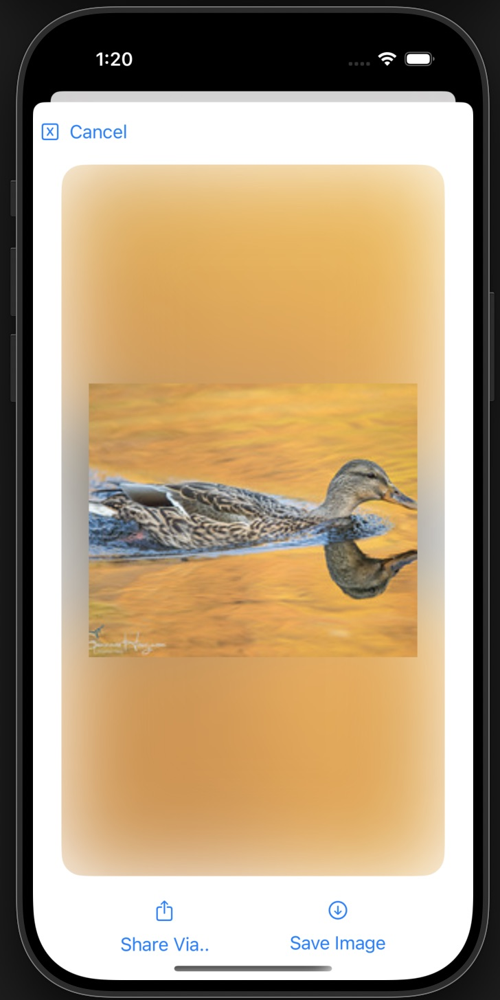
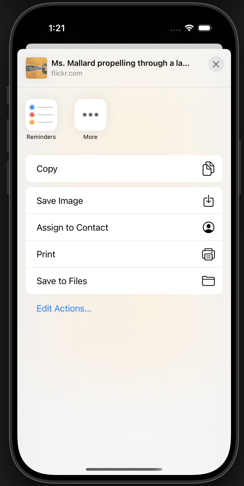

# Flickr Images App 🏞️

1. Search for images with multiple tags separated by a comma:


2. Click on an image in the grid to view it's details:


3. Dynamic image re-sizing for landscape orientation:


4. Custom action sheet:



## Setup Instructions

1. Clone the repository:
   ```bash
   git clone https://github.com/bsshanky/Flickr.git
   ```
   
2. Navigate to the project directory:
    ```
    cd Flickr
    ```
    
3. Open the project in Xcode:
    ```
    open Flickr.xcodeproj
    ```
    
4. Build and run the project on your chosen simulator or device.

### Additions:

Edit 1:

I've added the support for the landscape orientation throughout the app.

Edit 2:

I've added the support for sharing the image and it's link.

