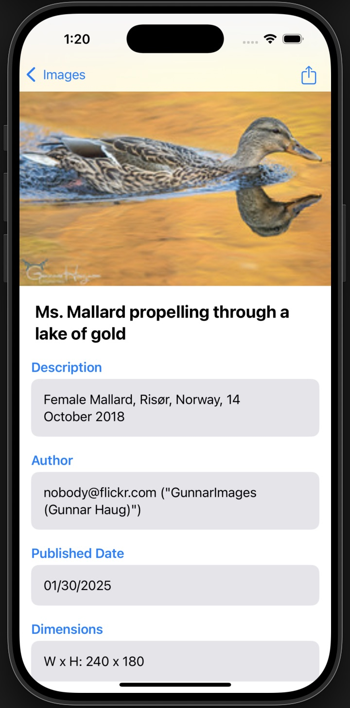

# Flickr Images App 🏞️

1. Search for images with multiple tags separated by a comma:


2. Click on an image in the grid to view it's details:


## Setup Instructions

1. Clone the repository:
   ```bash
   git clone https://github.com/bsshanky/Flickr.git
   ```
   
2. Navigate to the project directory:
    ```
    cd Flickr
    ```
    
3. Open the project in Xcode:
    ```
    open Flickr.xcodeproj
    ```
    
4. Build and run the project on your chosen simulator or device.

### Note to reviewers:

I have covered all the features listed in the Acceptance Criteria. In the Extra Credit, I was able to fetch the image dimensions. I am planning to work on the other extra credit features post submission. Thank you for the opportunity to work on this project!

Edit 1:

I've added the support for the landscape orientation throughout the app.

